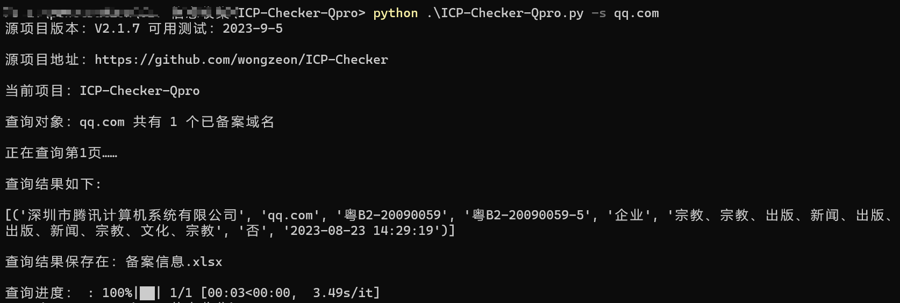
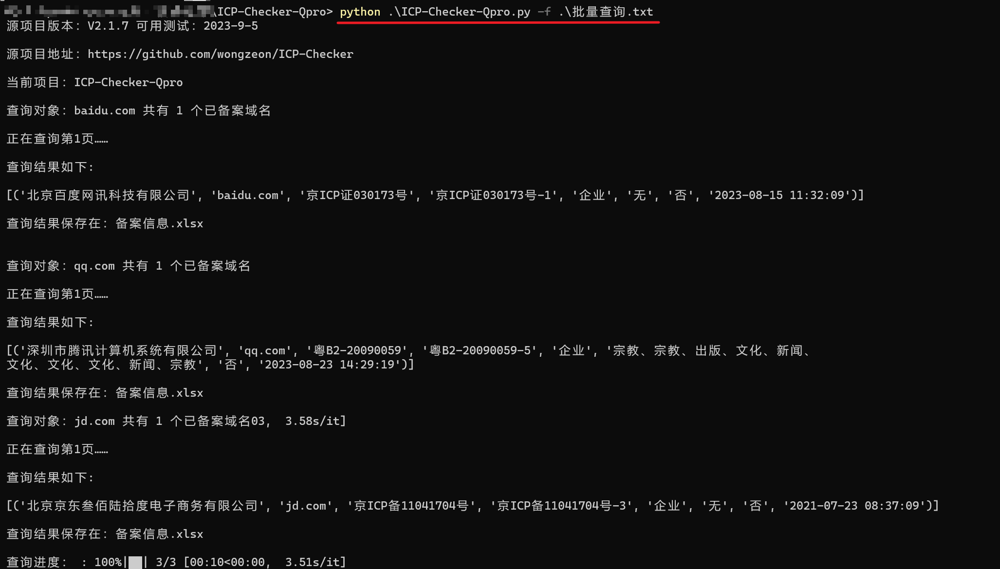
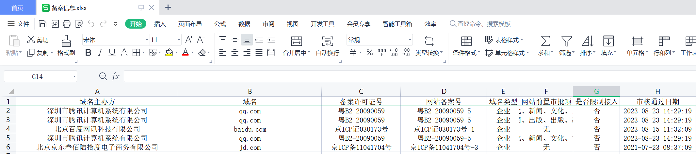

# 说明

本脚本根据 ICP-Checker 2.1.5 修改，支持了“粗糙的”批量查询，原作者计划中会支持批量，但目前还没支持。

https://github.com/wongzeon/ICP-Checker

## 原址功能

- [x] 通过  `https://beian.miit.gov.cn/` 查询信息，确保与管局实际信息一致

- [x] 支持通过域名、**公司全称**、备案号查询备案信息 

- [x] 自动完成拖动验证，存在极低的失败率 

- [x] 自动循环翻页查询，获取查询到的所有备案信息 

- [x] 自动将查询结果保存到表格文件 


## 修改增加

* 增加命令行功能
* 支持批量查询
  * 受限于基于IP的访问频率限制，无高并发
  * 每个查询间隔2秒，短时间内1个IP仅能查询100-200个
  * 可通过切换不同运营商热点的方法解决：将已查询过的域名在文件列表中删除，然后切换热点
  * 保存结果为追加保存，不必额外操作

* 增加进度条显示查询进度

# 使用


```python
PS E:\ICP-Checker-Qpro> python .\ICP-Checker-Qpro.py -h
Usage: ICP-Checker-Qpro.py [OPTIONS]

Options:
  -f, --file TEXT    一行一个的目标文件, 输入当前目录的文件名或文件绝对路径
  -s, --string TEXT  单个目标，支持域名、公司全称、备案号
  -h, --help         Show this message and exit.
```

# 示例








